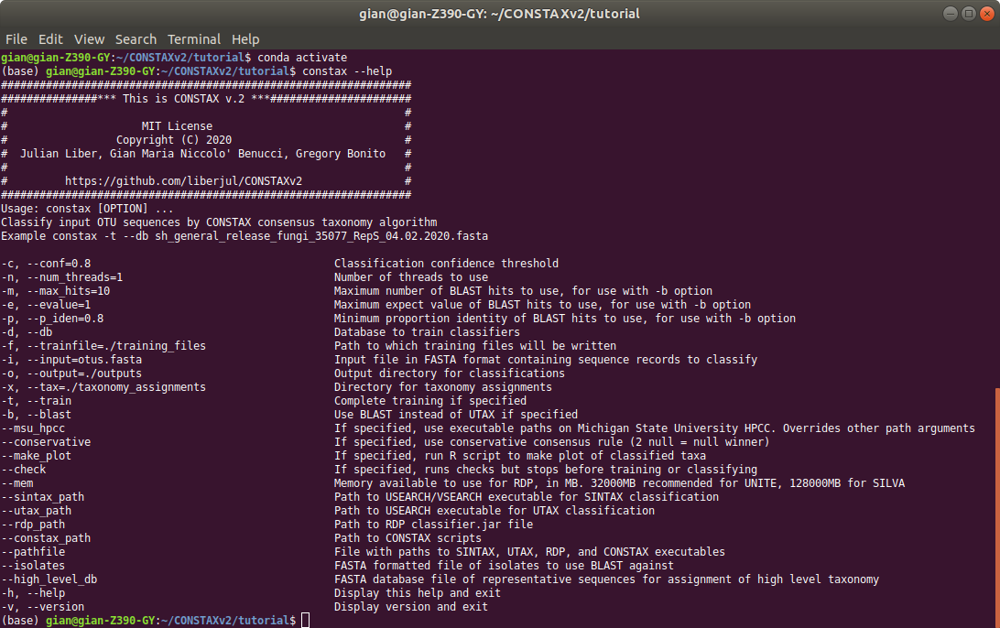

CONSTAX Options
===============

To visualize CONSTAX options:

.. code-block:: default

   gian@gian-Z390-GY:~/tutorial$ constax --help

This is what CONSTAX will display on the terminal

Options details
^^^^^^^^^^^^^^^

.. code-block:: default

   -c, --conf=0.8

Classification confidence threshold, used by each classifier (0,1]. Increase for improved specificity, reduced sensitivity.

.. code-block:: default

   -n, --num_threads=1

Number of threads to use for parallelization. Maximum classification speed at about 32 threads. Training only uses 1 thread.

.. code-block:: default

   -m, --max_hits=10

Maximum number of BLAST hits to use, for use with -b option. When classifying with BLAST, this many hits are kept. Confidence for a given taxa is based on the proportion of these hits agree with that taxa. 5 works well for UNITE, 20 with SILVA (standard, not NR).

.. code-block:: default

   -e, --evalue=1

Maximum expect value of BLAST hits to use, for use with -b option. When classifying with BLAST, only hits under this expect value threshold are used. Decreasing will increase specificity, but decrease sensitivity at high taxonomic ranks.

.. code-block:: default

   -p, --p_iden=0.8

Minimum proportion identity of BLAST hits to use, for use with -b option. Minimum proportion of conserve bases to keep hit.

.. code-block:: default

   -d, --db

Database to train classifiers. UNITE and SILVA formats are supported. See `Datasets <https://github.com/liberjul/CONSTAXv2#datasets>`_.

.. code-block:: default

   -f, --trainfile=./training_files
                    
Path to which training files will be written.

.. code-block:: default

   -i, --input=otus.fasta

Input file in FASTA format containing sequence records to classify.

.. code-block:: default

   -o, --output=./outputs

Output directory for classifications.

.. code-block:: default

   -x, --tax=./taxonomy_assignments

Directory for taxonomy assignments.

.. code-block:: default
   
   -t, --train

Complete training if specified. Cannot run classification without training files present, so this option is necessary at least at the first time you run CONSTAX or you changed the taxonomic referenced sequence database.

.. code-block:: default

   -b, --blast

Use BLAST instead of UTAX if specified. If installed with conda, this in the option that will work by default. UTAX is available from `USEARCH <https://www.drive5.com/usearch/download.html>`_. BLAST classification generally performs better with faster training, similar classification speed, and greater accuracy.

.. code-block:: default

   --msu_hpcc

If specified, use executable paths on Michigan State University HPCC. Overrides other path arguments.

.. code-block:: default

   --conservative

If specified, use conservative consensus rule (2 null = null winner. For example, if BLAST is the only algorithm that classifies OTU_135 to Family Strophariaceae while SINTAX and RDP give not classification, then no classification is reported at the rank of Family for OTU_135 in the CONSTAX taxonomy). According to our tests, works better for SILVA database to use this option.

.. code-block:: default

   --make_plot

If specified, run R script to make plot of classified taxa. The plot compares how many OTUs were classifies at each rank for RDP, SINTAX, BLAST, and CONSTAX.

.. code-block:: default

   --check

If specified, runs checks but stops before training or classifying.

.. code-block:: default
   
   --mem

Memory available to use for RDP, in MB. 32000MB recommended for UNITE, 128000MB for SILVA. This is necessary for training the referenced databases.

.. code-block:: default

   --sintax_path

Path to USEARCH/VSEARCH executable for SINTAX classification. Can also be ``vsearch`` if already on path.

.. code-block:: default

   --utax_path

Path to USEARCH executable for UTAX classification.

.. code-block:: default

   --rdp_path

Path to RDP ``classifier.jar`` file, or ``classifier`` if on path from RDPTools conda install.

.. code-block:: default

   --constax_path

Path to CONSTAX scripts.

.. code-block:: default

   --pathfile

File with paths to SINTAX, UTAX, RDP, and CONSTAX executables. This useful in your local CONSTAX installation, please the tutorial for how to set a pathifile up in your system.

.. code-block:: default

   --isolates

FASTA formatted file of isolates to use BLAST against.

.. code-block:: default

   --high_level_db

FASTA database file of representative sequences for assignment of high level taxonomy. For this option you can use the `SILVA <https://www.arb-silva.de/no_cache/download/archive/release_138/Exports/>`_ NR99 database for SSU/16S/18S sequences or the the `UNITE <https://plutof.ut.ee/#/doi/10.15156/BIO/786370>`_ database for Eukaryotic ITS/28S sequences. This option is useful to match your OTUs representative sequences to a reference using a lower cutoff so you can identify for example, which sequences are Fungi and which ones are not.
