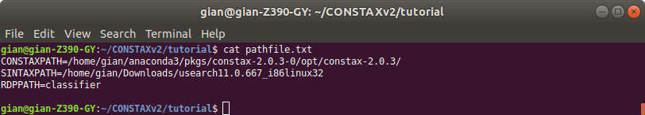

Running CONSTAX locally
=======================

This is a simple tutorial about CONSTAX. We will explain how to run CONSTAX on a
local computer like a laptop or a desktop computer.

Before we start, we need to create a folder called ``tutorial``. This CONSTAX test will happen
inside this folder so you first need to copy all the files you we will use before running the
software. We need the OTU representative sequence fasta file (e.g. ``otus.fasta``),
the representative sequence fasta file of your culture isolates if you have any and you want to
try to match with the OTUs (e.g. ``isolates.fasta``), and the sequence reference database you want to use, for Fungi (e.g. ``sh_general_release_eukaryotes_91074_RepS_04.02.2020.fasta``, see the :ref:`referenceDB` page for details).

You tutorial folder shuld look like this:

It is smart to use the sh command line interpreter, so will create a and ``.sh`` file and we will
write the CONSTAX commans in it.

.. code-block:: language

    gian@gian-Z390-GY:~/tutorial$ nano constax.sh
    
This is how the content of the ``.sh`` file should look like

.. note::

    Remember. If using a reference database for the first time, you will need to use the -t or **-\\-train** flag to train the classifiers on the dataset. The training step is necessary only at first use, you can just point to the **-\\-trainfile** <PATH> for the subsequent classifications with the same reference database.

The ``--pathfile`` option is necessary ONLY if you are planning to use USEARCH instead of VSEARCH for your classification. In this case we suggestd to create a ``pathfile.txt`` 

.. code-block:: language

    gian@gian-Z390-GY:~/tutorial$ nano pathfile.txt

where you will add the abosolute PATHs for the required softwares. VSEARCH, BLAST, and RDP are already available through the conda environment, what you will need is just USEARCH for the SINTAX classification. The pathfile.txt should look like this below:

.. warning::
    Remember to navigate through your anaconda installation and find the ``constax-2.0.3/`` folder.
    This is the only way to make CONSTAX locate the needed python scripts.

Before you can run CONSTAX you need to activate your anaconda environment (alternatively,
you can include this in the constax.sh file).

.. code-block:: language
    
    gian@gian-Z390-GY:~/tutorial$ conda activate

To see how to set up a conda environment with CONSTAX please refer to `this link <https://docs.conda.io/projects/conda/en/latest/user-guide/tasks/manage-environments.html>`_. 

At this point your are ready to give CONSTAX a try. 

.. code-block:: language

    gian@gian-Z390-GY:~/tutorial$ sh constax.sh

And CONSTAX will strat running...

When CONSTAX will be done you will see the outputs in the working directory.

.. image:: images/results.png
   :align: center

Training file and classification results will be stored in the specified folders. In this example 
the training files will be in ``training_files`` 

and the classification in ``taxonomy_assignments``

The taxonomic classification of your OTUs representative sequences will be in ``consensus_taxonomy.txt``. 

While classifiations perfomed by each classifier will be store in ``combined_taxonomy.txt``

.. image:: images/combined.png
   :align: center

Please explore other CONSTAX outpus, such as ``Classification_Summary.txt``. 

If you want to use some test ``otus.fasta`` to practice the use of CONSTAX you can find some in `THIS <https://github.com/liberjul/CONSTAXv2/tree/master/otu_files>`_ github repo of CONSTAX.

Now. We can try to run CONSTAX again changing some parameters to see some other options.
For example, modify the ``constax.sh`` script as showed below.

