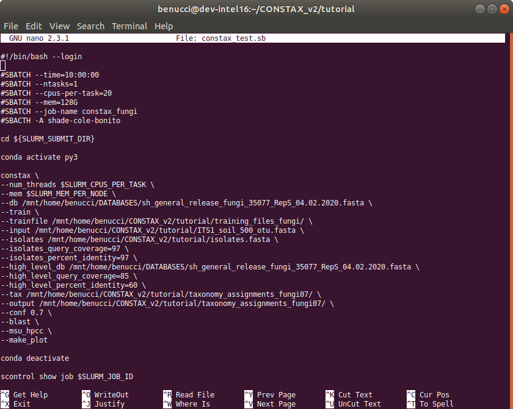

Run CONSTAX on HPCC
===================

To run CONSTAX on the high performance cluster computer or `HPCC <https://icer.msu.edu/>`_ available at Michigan State University, you can set the paths just using ``--msu_hpcc`` flag to your ``constax.sh`` file

The code will look like as below

.. note::

As you can see this time ``constax.sh`` does not contain the ``--train`` option, since the reference database has been already trained it is not required any additional training. This will improve the speed and therefore the running time will be less. The resources you need to compute just the classification are much less that those needed for training. You can then set the ``num_threads`` option to a lower number as well as the amount of RAM ``--mem``.
Additionally no ``--isolates`` is provided in this run of CONSTAX and the ``--hpcc_msu`` is specified at the end of the script.

To access some other representative OTU sequences files please follow `THIS <https://github.com/liberjul/CONSTAXv2/tree/master/otu_files>`_ link. These are the available files.

.. image:: images/otu_files.png
   :align: center
