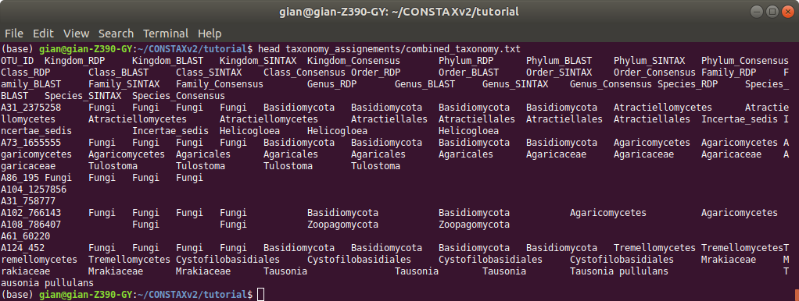

Run CONSTAX on HPCC
===================

To run CONSTAX on the high performace cluster computer present at  Michigan State University HPCC) you can set the paths just using ``--msu_hpcc`` flag to your ``condtax.sh`` file

The code will look like as bwlow

.. note:: 

As you can see this time ``constax.sh`` do not contain the ``--train`` option, since the refernce database has been already trained it is not required any additional training. This will imporve the speed and therefore the running time will be less. The resources you need to compute just the classification are much less that those needed for training. You can then set the ``num_threads`` option to a lower number as well as the amount of RAM ``--mem``.
Additionally no ``--isolates`` is provied in this run of CONSTAX and the ``--hpcc_msu`` is specified at the end of the script.

