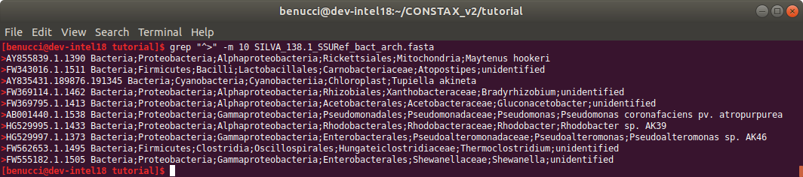

Generate SILVA reference database
=================================

This is a tutorial about how to generate a reference database, that can be used with CONSTAX.
from the SILVA database that contains Bacteria and Archaea sequences.

First thing to do is to download the SILVA reference database here.

Then, the best way is to create a script (it can be and ``.sh`` file or a ``.sb`` file depending
if you are running CONSTAX locally or on the MSU HPCC) that generates the Bacteria and the Archaea
``fasta`` files and directly concatenate them together.

This is how the content of the ``.sh`` file should look like

.. image:: images/format_silva.png
   :align: center

.. code-block:: language

   constax \
   -i SILVA_138.SILVA_138_SSURef_tax_silva.fasta \
   --select_by_keyword " Bacteria;" \
   --output silva_Db_bacteria.fasta

   constax \
   -i SILVA_138.SILVA_138_SSURef_tax_silva.fasta \
   --select_by_keyword " Archaea;" \
   --output silva_Db_archaea.fasta

   cat silva_Db_bacteria.fasta silva_Db_archaea.fasta > SILVA_138.1_SSURef_bact_arch.fasta
   rm silva_Db_bacteria.fasta silva_Db_archaea.fasta

.. warning::
    Remember to specify the keywords correctly, as they appear in the SILVA reference.
    For example, to target the Kingdom Bacteria the right keyword is ``" Bacteria;"``
    with a space before the name and ";" after it.

When the scripts are finished running you can inspect the results.

.. code-block:: language

   grep "^>" -m 10 SILVA_138.1_SSURef_bact_arch.fasta

The headers are formatted correctly and you can now use the newly created reference to classify your sequences.
