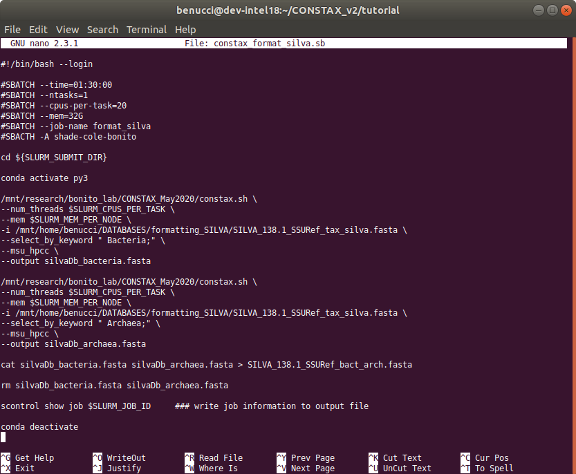

Generate SILVA reference database
=================================

This is a tutorial about how to generate a reference database, that can be used with CONSTAX. 
from the SILVA database that contains Bacteria and Archaea sequences.

First thig to do is to download the SILVA reference database here.

Then, the best way is to create a script (it can be and ``.sh`` file or a ``.sb`` file depending 
if you are running CONSATAX locally or on the MSU hpcc) that generates the Bacteria and the Arachaea 
``fasta`` files and directly concatenate them together.
 
This is how the content of the ``.sh`` file should look like

.. warning::
    Remember to specify the keywords correctly, as they appear in the SILVA reference. 
    FOr example, to target the Kingdom Bacteria the rigth keyword is ``" Bacteria;"``
    with a space before the name and ; after it. 

When the scripts is finished running you can ispect the results.

 .. image:: images/SILVA.png
   :align: center

The headers are formatted corrctly and you can now use the newly created reference to classify your sequences.

