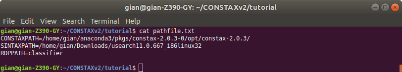

Tutorial
========

This is a simple tutorial about CONSTAX. We will explain how to run CONSTAX on a
local computer and also on a computer cluster like the `HPCC <https://icer.msu.edu/>`_ available at Michigan State University. 

Before we start, we need to create a folder called ``tutorial``. This CONSTAX test will happen
inside this folder so you first need to copy all the files you we will use before running the
software. We need the OTU representative sequence fasta file (e.g. ``otus.fasta``),
the representative sequence fasta file of your culture isolates if you have any and you want to
try to match with the OTUs (e.g. ``isolates.fasta``), and the sequence reference database you want to use, for Fungi (e.g. ``sh_general_release_eukaryotes_91074_RepS_04.02.2020.fasta``, see the Database section)
You tutorial folder shuld look like this:

.. code-block:: language

    gian@gian-Z390-GY:~/tutorial$ ll
    total 164224
    drwxr-xr-x 3 gian gian      4096 Dec 10 15:03 ./
    drwxrwxr-x 9 gian gian      4096 Dec 10 10:34 ../
    -rw-r----- 1 gian gian     71636 Dec  9 14:19 isolates.fasta
    -rw-r--r-- 1 gian gian     96548 Dec  9 14:04 otus_ITS.fasta
    -rw-r----- 1 gian gian 167965657 Dec 10 15:03 sh_general_release_eukaryotes_91074_RepS_04.02.2020.fasta

It is smart to use the sh command line interpreter, so will create a and sh file and we will
write the CONSTAX comman in it.

.. code-block:: language

    gian@gian-Z390-GY:~/tutorial$ nano constax.sh
    
This is how the content of the ``.sh`` file should look like

.. code-block:: language

    #!/bin/bash

    constax \
    --num_threads=10 \
    --mem 32000 \
    --db /home/gian/DATABASES/sh_general_release_eukaryotes_91074_RepS_04.02.2020.fasta \
    --train \
    --input /home/gian/CONSTAX_v2/tutorial/otus.fasta \
    --isolates /home/gian/CONSTAX_v2/tutorial/isolates.fasta \
    --trainfile /home/gian/CONSTAX_v2/tutorial/training_files/ \
    --tax /home/gian/CONSTAX_v2/tutorial/taxonomy_assignements/ \
    --output /home/gian/CONSTAX_v2/tutorial/taxonomy_assignements/ \
    --conf 0.8 \
    --blast \
    --pathfile /home/gian/CONSTAX_v2/tutorial/pathfile.txt

In the ``pathfile.txt`` you will include the abosolute PATHs for the software that are needed. VSEARCH,
BLAST, ans RDP are already available through the conda environment, what you need more is
USEARCH for the SINTAX classification.
The pathfile.txt should look like this below:

This above is how your pathfile should look like.

.. code-block:: language

   CONSTAXPATH=/home/gian/anaconda3/pkgs/constax-2.0.3-0/opt/constax-2.0.3/
   SINTAXPATH=/home/gian/Downloads/usearch11.0.667_i86linux32
   RDPPATH=classifier

As you can see you need to navigate through anaconda and find the ``constax-2.0.3/``

Before you can run CONSTAX you need to activate your anaconda environment (alternatively,
you can include this in the constax.sh file).

.. code-block:: language
    
    gian@gian-Z390-GY:~/tutorial$ conda activate

To see how to set up a conda environment with CONSTAX please refer to 

